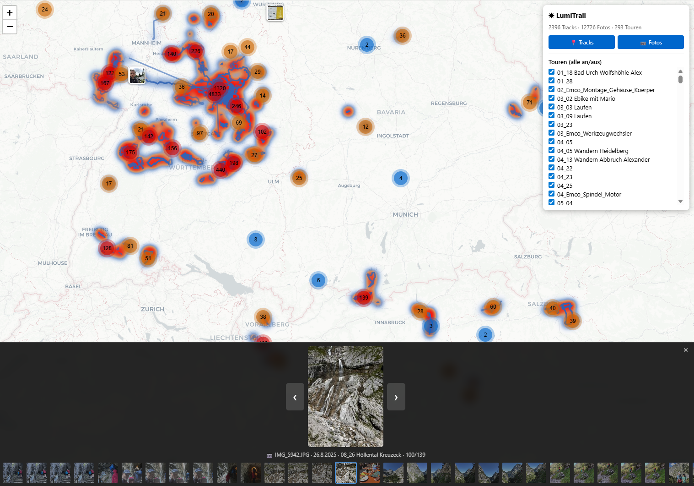

# LumiTrail

A lightweight tool to visualize GPX tracks and geotagged photos on an interactive map.

**An open-source project by [Lumiflow UG](https://lumiflow.de)**

## Why?

Every existing solution falls short in some way:

| Tool | Problem |
|------|---------|
| **GPXSee** | Interaction issues dep. on no of files |
| **Wanderer** | Slow, heavy |
| **PhotoPrism** | Photos only — no GPX track rendering |
| **PIGallery2** | Tracks displayed inconsistently |
| **Google My Maps** | Cloud-only, privacy concerns |

**LumiTrail** does one thing well: takes a folderstructure of GPX files and geotagged photos, and renders them on a fast, interactive map with heatmap-style track overlapping visualization and a photo gallery.

## Features

- **Heatmap-style track rendering** — overlapping tracks shift from blue → orange → red
- **Clustered photo markers** — smooth at any zoom level, even with thousands of photos
- **Photo gallery** — click a photo or cluster to browse nearby photos with arrow navigation
- **Fullscreen lightbox** — click to view original full-resolution photos
- **Tour filtering** — toggle tracks/photos by folder (tour)
- **Delta caching** — only new/changed files are re-processed on subsequent runs
- **File watching** — `--watch` mode automatically picks up new photos and GPX files without restarting
- **Fast startup** — preprocessed data loads in seconds
- **Offline-capable** — works on local network drives, no internet needed (except for map tiles)

## Screenshot



## Installation

### Option A: Ready-to-run EXE (Windows)

Download `lumitrail.exe` from the [Releases](../../releases) page — no Python installation needed.

### Option B: Docker (Linux / NAS / Synology)

Runs as a container — no Python installation needed. Works on any Linux host including **Synology NAS** via Container Manager.

See [Docker setup](#docker) below.

### Option C: Run from source

This repository contains the Python source code. Requirements:

- **Python 3.10+** with a conda environment
- **conda packages**: `gpxpy`, `pillow`, `watchdog` (installed via conda-forge)

## Expected Folder Structure

The tool expects a directory with GPX files and/or photos (JPEG with EXIF GPS data).  
Subdirectories are treated as separate "tours":

```
2025 Wandern Rad/
├── 08_23_Partnach_Eibsee/        ← tour folder
│   ├── track.gpx
│   ├── IMG_5865.JPG
│   └── IMG_5866.JPG
├── 10_30 Hotzenplotz Pfad/
│   ├── 2025-10-30_Wandern.gpx
│   └── photo1.jpg
├── 2025-01-05_Wandern.gpx        ← loose GPX (grouped under parent folder name)
└── 2025-03-07_Ride.gpx
```

- **GPX files** (`.gpx`): Any standard GPX with tracks or routes
- **Photos** (`.jpg`, `.jpeg`, `.png`): Must have EXIF GPS coordinates to appear on the map. Photos without GPS are silently skipped.

## Setup (from source)

```bash
# Create conda environment
conda create -n lumitrail python=3.11 -y
conda install -n lumitrail -c conda-forge gpxpy pillow watchdog -y
```

## Usage

### With the EXE

```
lumitrail.exe "X:\path\to\your\photos_and_gpx"
```

### With the BAT launcher (from source)

```
lumitrail.bat "X:\path\to\your\photos_and_gpx"
```

This will:
1. Scan the directory for GPX tracks and geotagged photos
2. Generate thumbnails and a JSON index
3. Open the interactive map in your browser at `http://localhost:8080`

### Manual steps

**Step 1: Preprocess**

```bash
conda run -n lumitrail python preprocess.py "X:\path\to\photos" -o ./map_output
```

Scans recursively, parses GPX, extracts EXIF GPS, generates thumbnails.  
A `.cache.json` is stored in the output directory — on subsequent runs, only new or modified files are re-processed (delta caching based on file size + mtime).

Multiple input directories can be specified:

```bash
conda run -n lumitrail python preprocess.py "X:\2024 Wandern Rad" "X:\2025 Wandern Rad" -o ./map_output
```

**Step 2: Serve**

```bash
conda run -n lumitrail python server.py -d ./map_output
```

Opens `http://localhost:8080` with the interactive map.  
The server serves thumbnails from `map_output/` and original photos directly from their source locations.

## Docker

### Setup

Edit `docker-compose.yml` and point the volume to your photo/GPX directory:

```yaml
volumes:
  - /path/to/your/photos:/data:ro   # adjust this
  - lumitrail_output:/output
```

Then start the container:

```bash
docker compose up -d
```

LumiTrail will scan `/data` on startup, then watch for new files automatically (polling every 30 seconds by default).  
Open `http://localhost:8080` in your browser.

### Synology NAS

LumiTrail runs on Synology via **Container Manager** (DSM 7.2+):

1. Copy `Dockerfile` and `docker-compose.yml` to a folder on your NAS (e.g. `/volume1/docker/lumitrail`)
2. In Container Manager → **Projects** → **Create** → select that folder
3. Adjust the volume path in `docker-compose.yml` to point to your photos (e.g. `/volume1/photos`)
4. Click **Build** — the container starts, preprocesses, and serves the map

Access the map at `http://<nas-ip>:8080`. The `--watch` flag ensures newly added photos and GPX files are picked up automatically without restarting.

### Options

| Flag | Default | Description |
|------|---------|-------------|
| `--watch` | off | Watch input dirs and reprocess new/changed files |
| `--watch-interval N` | 30 | Poll interval in seconds |
| `--no-browser` | off | Don't open browser on start (always set in Docker) |
| `-p PORT` | 8080 | Server port |

Multiple input directories are supported:

```yaml
command: ["/data/2024", "/data/2025", "-o", "/output", "--watch", "--no-browser"]
```

## Architecture

```
preprocess.py  →  map_output/
                   ├── index.json      (track overviews + photo metadata)
                   ├── index.html      (Leaflet viewer)
                   ├── .cache.json     (delta cache for fast re-runs)
                   ├── thumbs/         (300px JPEG thumbnails)
                   └── tracks/         (full-resolution track JSONs)

server.py      →  serves map_output/ + originals from source paths
                   localhost:8080
```

- **Tracks** are simplified to ~150 points for the overview. Full resolution loads on click.
- **Photos** are displayed as clustered thumbnail markers. Originals are served on-demand for the lightbox.
- **Heatmap overlay** shows track density with a blue→red gradient.

## Performance

Tested with **~13,000 photos** and **~3,000 GPX tracks**:

- **First run**: several hours (thumbnail generation, GPX parsing, EXIF extraction)
- **Subsequent runs**: seconds (delta caching — only new/changed files are reprocessed)

## License

This project is licensed under the **GNU General Public License v3.0** — see the [LICENSE](LICENSE) file for details.

Made with ☀ by [Lumiflow UG](https://lumiflow.de)
